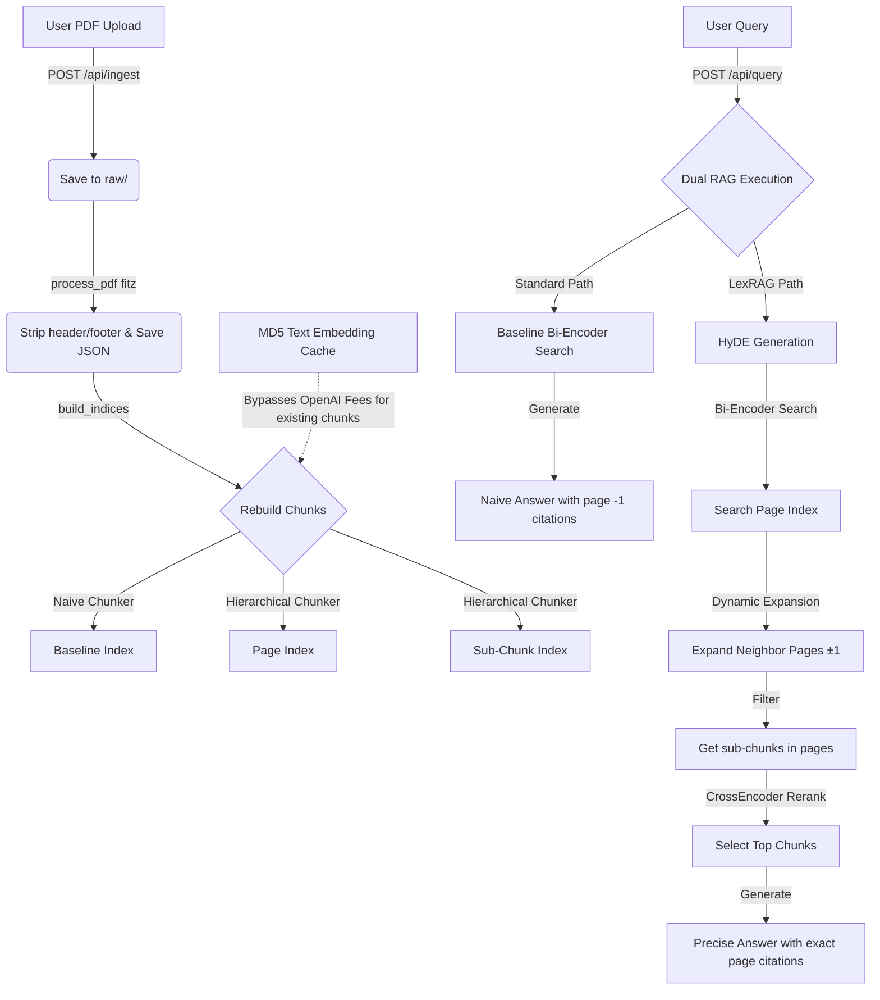

# LexRAG — Advanced Legal & Medical RAG Sandbox

**LexRAG** is a Retrieval-Augmented Generation (RAG) system purpose-built for dense legal and medical document question-answering. Standard RAG pipelines struggle with multi-page legal opinions, complex circulars, and tax statutes because they are blind to page structures, split sentences mid-thought, and lose original citation anchors. 

This repository contains both a complete offline re-indexing pipeline and a **visually stunning web sandbox** to upload PDFs, run comparative queries, and compare the advanced **LexRAG** pipeline against a **Standard Naive RAG** baseline side-by-side.

---

## 📖 Why LexRAG is Superior (ELI5)

Imagine you are looking for an answer inside a giant stack of books. Here is why LexRAG wins every single time:

1. **No Page-Boundary Blindness**  
   * *The Problem*: Naive RAG slices the text at a fixed length, cutting sentences right in half across page folds. It is like tearing pages out of a book and gluing arbitrary halves together, losing the physical page numbers entirely (represented as page `-1`).
   * *LexRAG Solution*: We use hierarchical page-aware chunking to respect physical pages, preserving page structures and retaining exact page numbers for high-fidelity citations.

2. **Spanning Questions Resolution**  
   * *The Problem*: If a legal rule starts on page 34 and concludes on page 35, naive search only returns one page, completely missing the other half of the rule.
   * *LexRAG Solution*: When LexRAG finds a relevant page, it automatically gathers its next-door neighbors (±1 page) before searching for sub-chunks. This captures context that spans multiple pages seamlessly.

3. **Hypothetical Document Embeddings (HyDE)**  
   * *The Problem*: You might ask a question using common words ("what is the fine?"), but the document uses formal language ("monetary penalty accrued"). Naive vector search fails to match these terms.
   * *LexRAG Solution*: LexRAG uses LLM-generated hypothetical answers to bridge vocabulary gaps. The vector search is performed on the *ideal answer* rather than your raw question, matching the document's formal terminology.

4. **Deep CrossEncoder Re-Ranking**  
   * *The Problem*: Embeddings are great for finding candidates quickly but lack the accuracy to score exact document relevance, leading to noisy contexts.
   * *LexRAG Solution*: LexRAG uses a secondary precision pass with a CrossEncoder (`cross-encoder/ms-marco-MiniLM-L-6-v2`) to joint-score and select only the absolute best sub-chunks for the generator, keeping the prompt clean.

---

## 🛠️ Architecture Flow



---

## 🔒 Security & Environment Configuration

> [!WARNING]
> **Strict Key Security Policy:** Do not export API keys or environment secrets in production configurations.
> All secrets in this project are loaded dynamically from a local `.env` file using `python-dotenv`. The `.env` file is explicitly listed in `.gitignore` and must never be committed to source control.

---

## 🚀 Setup & Execution Guide

### Prerequisites
- An **OpenAI API Key** (for text embeddings and GPT-4o-mini generation).
- For Docker execution: **Docker and Docker Compose** installed.
- For local manual execution: **Python 3.12.x** installed.

---

### Method A: Run via Docker Compose (Recommended)

This project has been fully containerized into a multi-container microservice system using Nginx (frontend reverse proxy) and FastAPI (backend engine).

1. **Configure your API Key**:
   Create a `.env` file in the root of the project:
   ```env
   OPENAI_API_KEY=sk-proj-YOUR_ACTUAL_KEY_HERE...
   ```

2. **Spin up the containers**:
   Run the following command in the root folder:
   ```bash
   docker-compose up --build -d
   ```

3. **Explore the Sandbox**:
   Open your browser and go to **[http://localhost:8080](http://localhost:8080)**.
   * *Nginx* is listening on port `8080` (routing static assets directly and forwarding `/api` calls).
   * *FastAPI* is listening internally and mapped to port `8000`.
   * *Data Persistence*: Your ingested PDFs, processed JSONs, FAISS indices, and embedding caches are stored inside the local `./data` folder on your host machine, meaning your indexing survives container restarts.

4. **Shutdown**:
   ```bash
   docker-compose down
   ```

---

### Method B: Local Manual Running

1. **Clone this repository and create a Python virtual environment**:
   ```bash
   # 1. Create and activate virtualenv
   python -m venv venv

   # Windows (Command Prompt):
   venv\Scripts\activate.bat
   # Windows (PowerShell):
   venv\Scripts\activate.ps1
   # Unix/macOS:
   source venv/bin/activate

   # 2. Install dependencies
   pip install -r requirements.txt
   ```

2. **Configure your API Key**:
   Create a `.env` file in the root of the project:
   ```env
   OPENAI_API_KEY=sk-proj-YOUR_ACTUAL_KEY_HERE...
   ```

3. **Run the Web Server**:
   Start the FastAPI app using the startup helper script:
   ```bash
   python run_server.py
   ```
   Open your web browser and navigate to **[http://127.0.0.1:8000](http://127.0.0.1:8000)**.

---

## 🧪 Interactive Playground Features

1. **Ingestion Dashboard**: Drag and drop any legal or medical PDF into the upload zone. Watch the progression as it cleans headers/footers, slices hierarchical chunks, runs cached re-indexing in a fraction of a second, and immediately updates live stats (documents, pages, cache size).
2. **Side-by-Side Comparison**: Submit a query or select a pre-populated sample query. Review both models side-by-side:
   - **Baseline RAG**: Answers generated with blind fixed-size chunking. Check the citations to see page `🚨 Unknown Page (-1) - Boundary Blown!` markers.
   - **LexRAG**: Answers generated with dynamic expansion and re-ranking. See the precise citation list with exact page numbers.
3. **Winner Diagnostics**: An automated analyzer panel breaks down the exact reasons why LexRAG's mathematical approach succeeded for your specific question.
4. **ELI5 Section**: An interactive educational guide detailing vector mismatch, spanning questions, and page boundaries to explain legal RAG to technical and non-technical stakeholders.

---

## 🛠️ Offline Pipeline (Advanced)
If you wish to run pipeline scripts directly in the terminal, you can utilize the CLI scripts:

```bash
# 1. Download sample PDFs
python src/data/downloader.py

# 2. Process PDFs to JSON
python src/data/processor.py

# 3. Build FAISS Indices programmatically
python src/data/indexing.py

# 4. Run retrieval smoke tests
python tests/test_retrieval.py

# 5. Run generation smoke tests
python tests/test_generation.py
```
